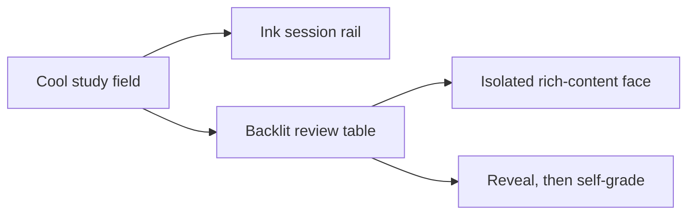

# Visual system

The player is a quiet reprographic light table: one clean, backlit face holds the learner's attention while a compact dark rail explains what review will do next.

## Palette and material

| Role | Value | Use |
| --- | --- | --- |
| Deep ink | `#092c3b` | Masthead, session rail, primary reveal control |
| Pale field | `#e6f3f4` | Ambient study ground |
| Clean face | `#ffffff` | Sandbox frame; authors' content takes precedence |
| Teal | `#086f77` | Confirmed actions and interactive focus |
| Amber | `#f2bb68` | Revisit signal, kept off the reading face |
| Registration line | `#acc9cd` | Delineation without decorative cards |

The page uses cool daylight rather than a dark coding theme: a learner may study text, diagrams, and code side by side at a desk. The answer transitions as a second layer with one short settle motion; the content itself stays flat, not translucent. No imagery is required. Barlow Condensed is self-hosted for titles and controls under its included SIL OFL license at `site/fonts/OFL.txt`; body text uses a workhorse sans stack. Code in a face uses the browser monospace stack.

## Composition

At desktop widths, the review rail is narrow and dark while the canvas owns the remaining horizontal space. At phone widths the rail becomes a readable status strip above the same canvas. The face frame scrolls internally because its content is sandboxed and its height cannot be read by the parent. The same status hierarchy survives long code, SVG, MathML, and short text prompts.

The first action is always **Reveal answer**. Only after revelation do **Review again** and **Got it right** appear. Counts use tabular numerals; no progress ring or inferred mastery claim. Imported titles and citations are rendered as text, never as parent-page HTML.

## States and boundaries

Loading, invalid import, inaccessible storage, prompt, answer, and session completion have explicit language. Keyboard focus is visible; reduced-motion users get an effectively static transition. The rich face lives in an opaque-origin `sandbox="allow-scripts"` iframe with an in-frame resource CSP. Parent styling never assumes a domain-specific card shape; author CSS may customize the frame without changing app chrome. Security limitations and author guidance live in `README.md`.

The direction was selected as the unconfirmed default when the visual-choice page received no answer; its durable surface contract is in `.impeccable/surfaces/site-index-html.md`. The UI may be retuned without changing the versioned stack format.
