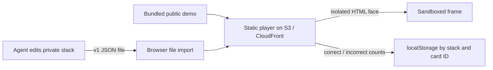

# goodvibes.flashcards

A static, local-first flashcard player for rich, agent-authored stacks. Import a JSON file, recall one answer at a time, and self-grade. Review counts stay in the browser; a separate private repository owns personal cards.



## Run locally

Requires Node 22+ for checks and Python 3 for local serving; the deployed app has no runtime dependencies.

```sh
npm test
npm run validate
npm run serve
# Visit http://localhost:8080
```

Use **Import stack** to open a local JSON file, including one from [the private stack repo](https://github.com/mikewrather/flashcard-stack) if you have access. The browser does not fetch that repo or request credentials. An imported file remains in memory for this page session, not in localStorage; re-import after reloading. The included demo is public illustrative content.

## Stack format

The [v1 JSON Schema](./schemas/stack-v1.schema.json) and the [player validator](./site/lib/stack.js) define the format. The version string is mandatory; new formats get a new version rather than changing v1 silently. A minimal stack:

```json
{
  "format": "goodvibes.flashcards/stack-v1",
  "id": "math.foundations",
  "title": "Foundations",
  "cards": [
    {
      "id": "parabola-shape",
      "tags": ["math", "graphs"],
      "front": { "html": "<p>What is the shape of this graph?</p><math><mi>y</mi><mo>=</mo><msup><mi>x</mi><mn>2</mn></msup></math>" },
      "back": { "html": "<p>An upward-opening parabola with a vertex at (0, 0).</p>" },
      "source": "Optional citation or context"
    }
  ]
}
```

`id` is a lowercase 2–80 character stable identifier (letter or digit first; dots, underscores, and hyphens allowed). Keep the stack ID and each card ID when editing: stored progress is keyed by both. Do not reuse an ID for a different question. `tags` and `source` are optional; unknown fields are rejected so agents do not accidentally invent incompatible types. Card faces are HTML fragments, not Markdown. They may contain HTML, MathML, SVG, `<style>`, inline scripts, and self-contained media such as ``; use semantic descriptions for non-text media. See [the demo](./site/demo.json) for curve, logic, code, and interactive examples.

Validate before importing or submitting a stack:

```sh
node scripts/validate-stack.mjs /path/to/stack.json
```

The validator checks structure, lengths, IDs, duplicate card IDs, tags, and version. It does **not** verify that an answer is true or that an HTML fragment is safe. Each JSON file is limited to 10 MiB and 5000 cards.

## Review behavior

A session starts with each card once. A prior excess of incorrect over correct grades adds up to two later review slots for that card. An incorrect grade inserts the card again after up to two other pending cards; a correct grade completes that occurrence. This is a deliberately small revisit rule, **not** Anki/FSRS or a calendar-based spaced-repetition claim. On another visit, import the stack again and the stored counts still influence its queue. There is no account, sync, or due-date scheduler.

## Code in card faces

A stack is executable content, even if its file is yours today: copied or agent-produced stacks can contain malicious code. Rendering directly in the player origin would let that code read localStorage, alter review records, and try to send private cards elsewhere. Each face instead loads into a fresh `<iframe sandbox="allow-scripts">` without `allow-same-origin`, forms, popups, or top navigation. The frame's CSP blocks network fetches and remote resource subrequests and permits inline scripts and `data:` or `blob:` media. The player ignores frame messages. This separates a face from the parent DOM and other imported stacks, **not** from its own HTML: face scripts can read their own content, consume CPU, or attempt to navigate their own frame. CSP is not a guarantee against every network side channel. Review the origin of an imported stack; never embed credentials or sensitive material in its face HTML. Only the counts per ID live in localStorage, not private card content.

Browser-specific isolation and deployment headers must be tested when changing the frame policy. A CloudFront CSP on the parent may also apply to `srcdoc` frames and inadvertently block inline card scripts; test interactive cards against the deployed policy.

## Deployment

Serve the contents of `site/` as static files. For S3 + CloudFront, configure the bucket with private origin access (OAC), a CloudFront default root object of `index.html`, HTTPS, and suitable MIME types for `.js`, `.json`, `.css`, and `.html`. Upload only `site/` to the public bucket; **never** upload the private stack repo or the repo root.

```sh
aws s3 sync site/ s3://YOUR_PUBLIC_BUCKET/
# Invalidate CloudFront's index.html and demo.json after updates as needed.
```

There is no deployment target, bucket, or distribution configured in this repo; this command is an example, not an executed deployment.

## Prior art and boundaries

[Anki's notes, fields, and card templates](https://docs.ankiweb.net/getting-started.html#notes--fields) show how one fact can yield multiple review directions, while [its scheduling](https://docs.ankiweb.net/deck-options.html#fsrs) is substantially richer. v1 intentionally starts with independent front/back cards and a simple incorrect-first queue; derived cards, cloze, deck nesting, sync, and a real scheduler can be added only when needed.

The [Sourcerer Project Card](./.sourcerer/project.md) advertises platform work and format ownership. The private stack repo advertises `card-authoring`. Project Cards require separate registration in Sourcerer before routing can use them.
